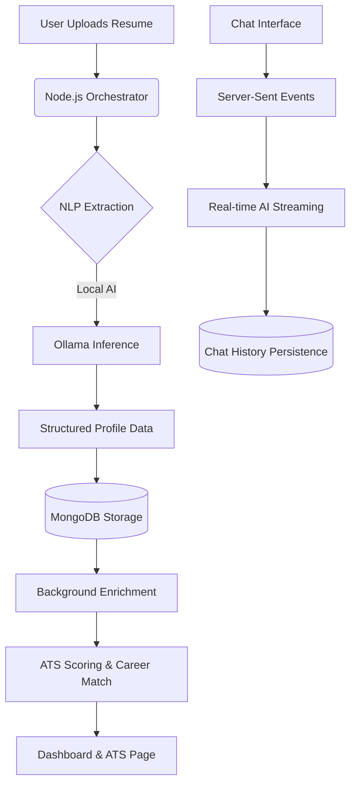
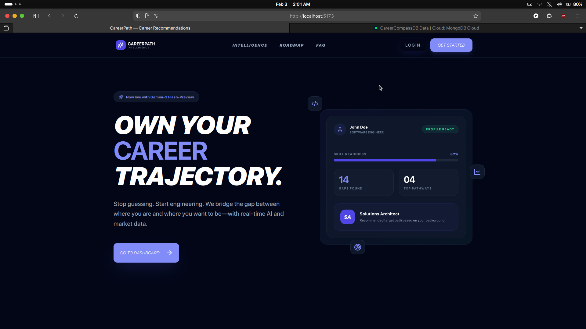
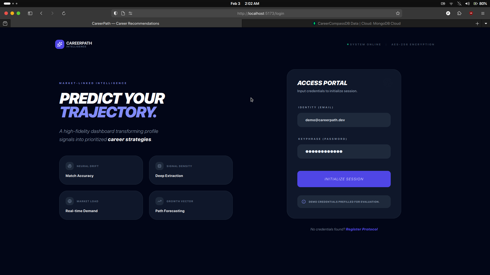
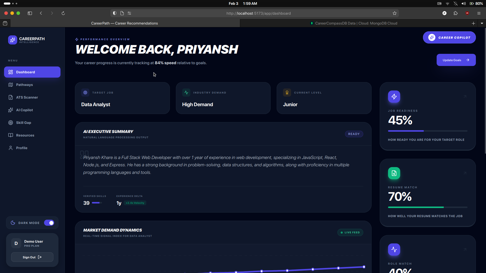
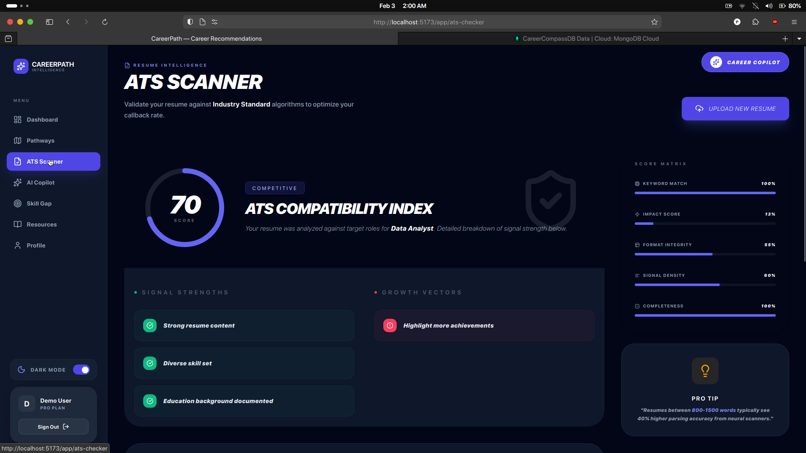
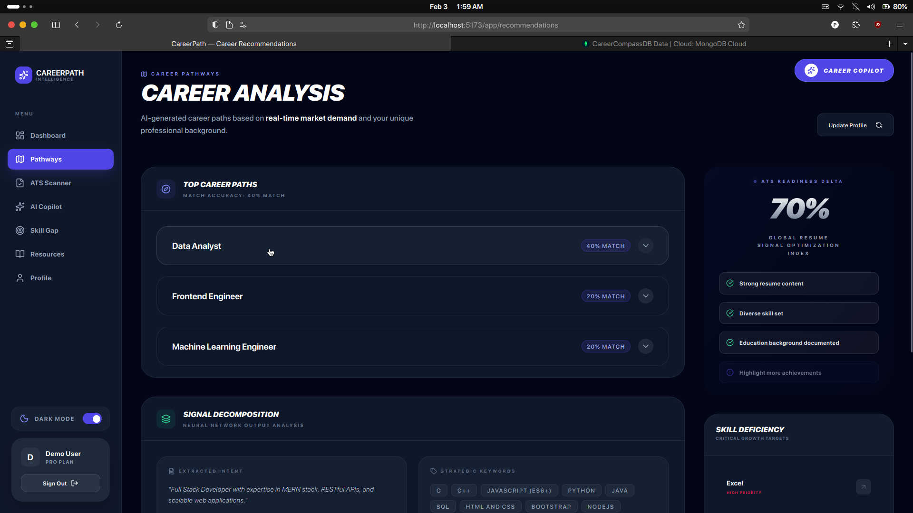
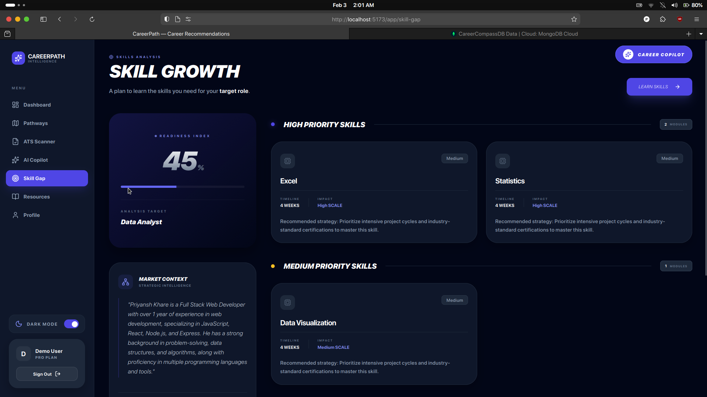
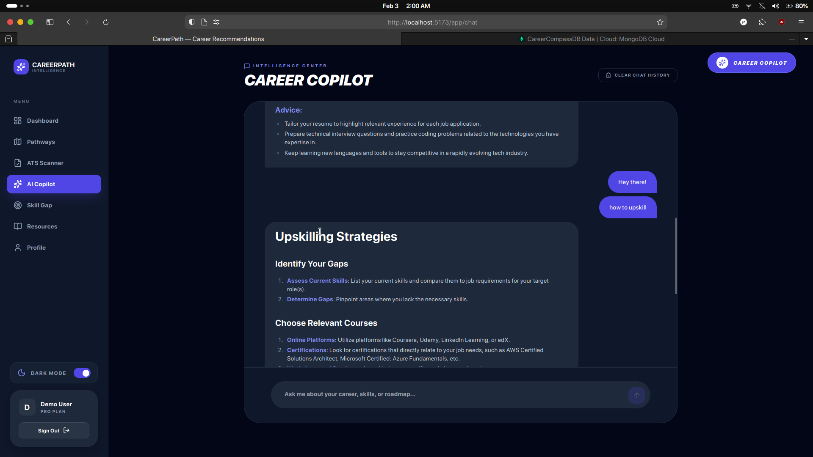
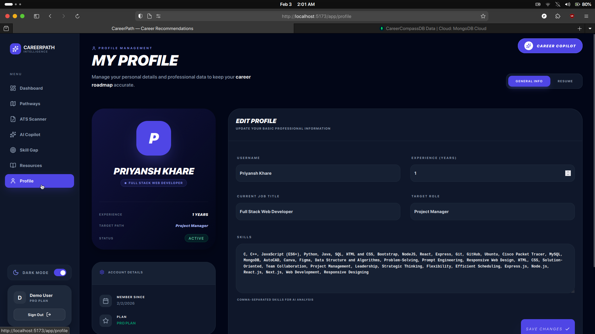
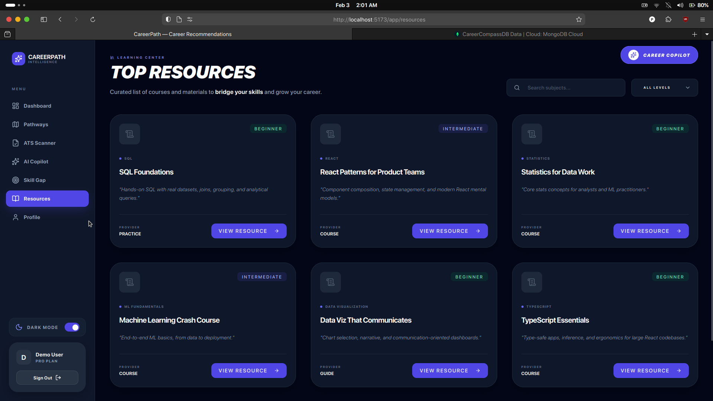

# 🚀 CareerPath Intelligence Suite

A comprehensive, production-grade ecosystem for AI-driven career development and resume intelligence. This platform leverages **Local LLMs (Ollama)** to provide high-fidelity ATS analysis, career coaching, and skill-gap visualization while ensuring maximum user data privacy through local processing.

---

## 🏗 System Architecture & Design Flow

The system is designed using a **Decoupled Micro-Controller Architecture** where the Node.js backend acts as an orchestrator between the React frontend, the MongoDB state layer, and the Local AI inference engine.

### 🌐 System Design Flow


### 🧠 The Intelligence Pipeline
1.  **Ingestion**: Resumes (PDF/Text) are parsed via `pdf-parse` and sent to `Ollama`.
2.  **Structuring**: The `qwen2.5-coder` model extracts entities (Skills, Experience, Education).
3.  **Analysis**: The engine runs weighted comparison algorithms to determine career readiness.
4.  **Feedback**: Generates "Growth Vectors" (actionable tips) and "Semantic Matrix" (keyword gaps).

---

## 📂 Directory Structure

### 💻 `frontend/` (React + Tailwind)
*   `src/components/chat/`: Real-time SSE chat widget with message persistence.
*   `src/pages/app/`: Core application views (ATS Checker, Dashboard, Skill Gap).
*   `src/lib/state/`: Centralized authentication and application state management.
*   `src/styles/`: Custom Tailwind themes and professional SaaS CSS variables.

### ⚙️ `backend/` (Node.js Orchestrator)
*   `src/controllers/`: Business logic for AI recommendations and profile management.
*   `src/services/geminiClient.js`: The **Local AI Driver** (Interfaces with Ollama REST API).
*   `src/models/`: MongoDB schemas (User, Profile, Chat).
*   `src/middleware/`: JWT validation, Error handling, and Guard logic.

### 🐍 `ml-service/` (Python/FastAPI)
*   Specialized Python microservice for heavy text analysis and deterministic data enrichment.

---

## ⚡ Performance & Caching Strategy

To solve the inherent latency of local LLMs (Ollama), the platform implements a **High-Performance Caching Layer** within MongoDB.

### How the Cache Functions:
-   **Triggering**: Every AI analysis result is stored in the `cachedRecommendations` field of the user's `Profile` model.
-   **Invalidation**: The `needsRegeneration` boolean flag is set to `true` whenever a user updates their skills, experience, or resume.
-   **TTL Logic**: Cached data has a 24-hour expiration check (`cacheAge`). If the cache is fresh and `needsRegeneration` is false, the system returns data in **<50ms**.
-   **Fallback Safety**: In cases of AI engine timeouts, a heuristic fallback engine calculates baseline scores to ensure the UI remains functional.

---

## 📸 Feature Showcase

### 🏠 Landing & Authentication

*Modern, high-conversion landing page with detailed value propositions.*


*Secure JWT-based authentication flow with integrated onboarding wizard.*

### 📊 Dashboard & Analytics

*Central intelligence hub featuring career progress tracking and market metrics.*

### 🕵️ ATS Intelligence Hub

*Full-screen resume analysis featuring gauge animations, signal strength breakdowns, and raw text verification.*

### 🧠 Career Analysis & Skill Gap

*Detailed career path matches with AI-driven confidence scoring.*


*Visualizing the roadmap to your target role with categorized missing skills.*

### 💬 AI Career Copilot

*Real-time, persistent chat interface powered by local AI for deep career insights.*

### 👤 Profile & Resources

*Unified profile management and skill indexing.*


*Curated roadmap to bridge the identified skill gaps.*

---

## 🛠 Tech Stack Deep-Dive

| Layer | Technology |
| :--- | :--- |
| **Logic Orchestration** | Node.js (Express) |
| **Intelligence Engine** | Ollama (`qwen2.5-coder:7b`) |
| **Data Persistence** | MongoDB (Mongoose) |
| **Frontend Foundation** | React 18 + Vite |
| **Styling Engine** | Tailwind CSS + Radix/Lucide |
| **Data Visualization** | Recharts (SVG/Canvas based) |
| **Real-time Comms** | Server-Sent Events (SSE) |

---

## 🚦 Getting Started

### 1. Prerequisites
- **Ollama**: [Download Ollama](https://ollama.ai/) and run `ollama serve`.
- **Model**: This project is optimized for `qwen2.5-coder:7b`. Pull it with `ollama pull qwen2.5-coder:7b`.
- **Node.js**: v18+.
- **MongoDB**: Local instance or Atlas URI.

### 2. Installation
```bash
# Clone the repository
git clone https://github.com/PriyanshK09/CareerPath.git

# Install Backend
cd backend && npm install
npm run dev

# Install Frontend
cd ../frontend && npm install
npm run dev
```

---
*Created by [Priyansh & Aashish](https://github.com/aashish-shukla)*

